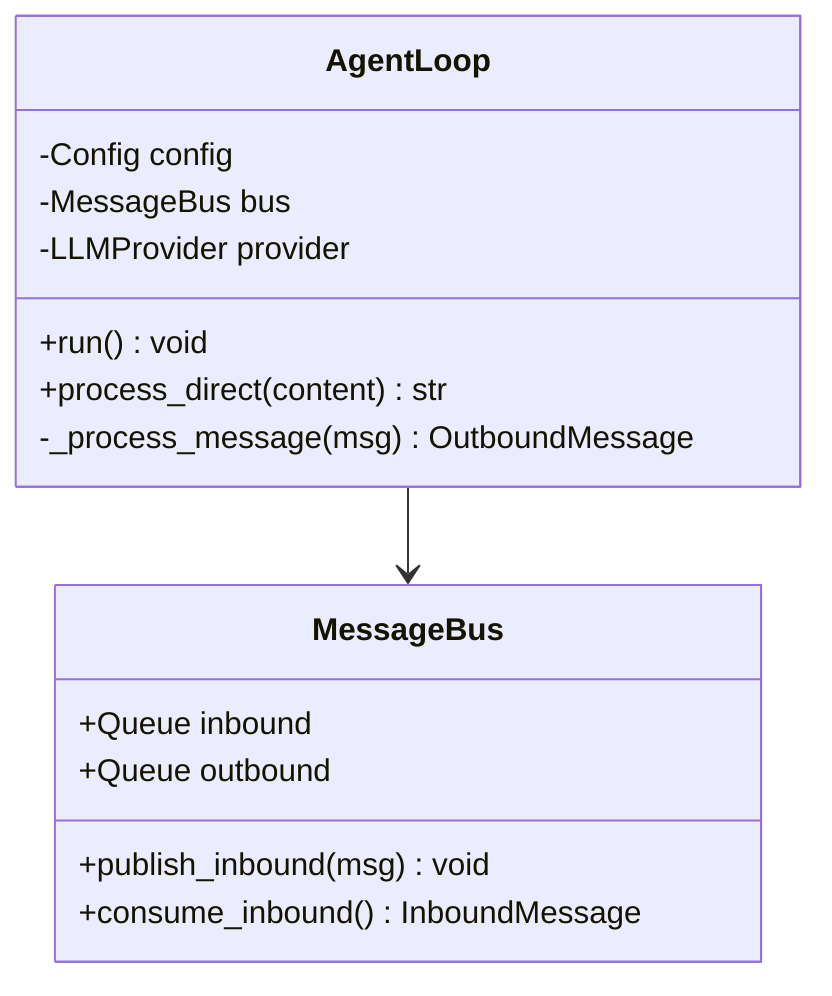
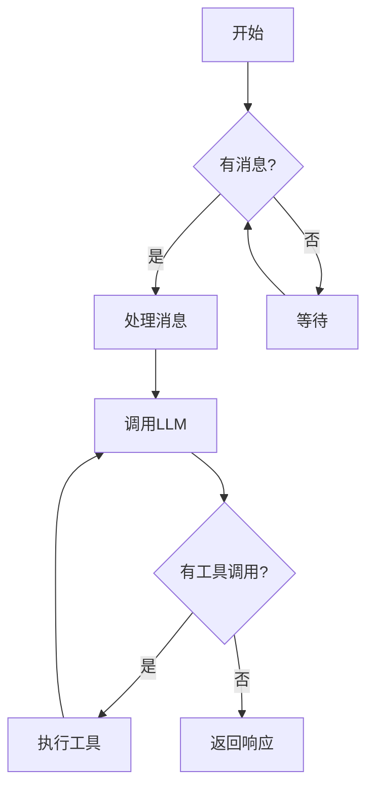
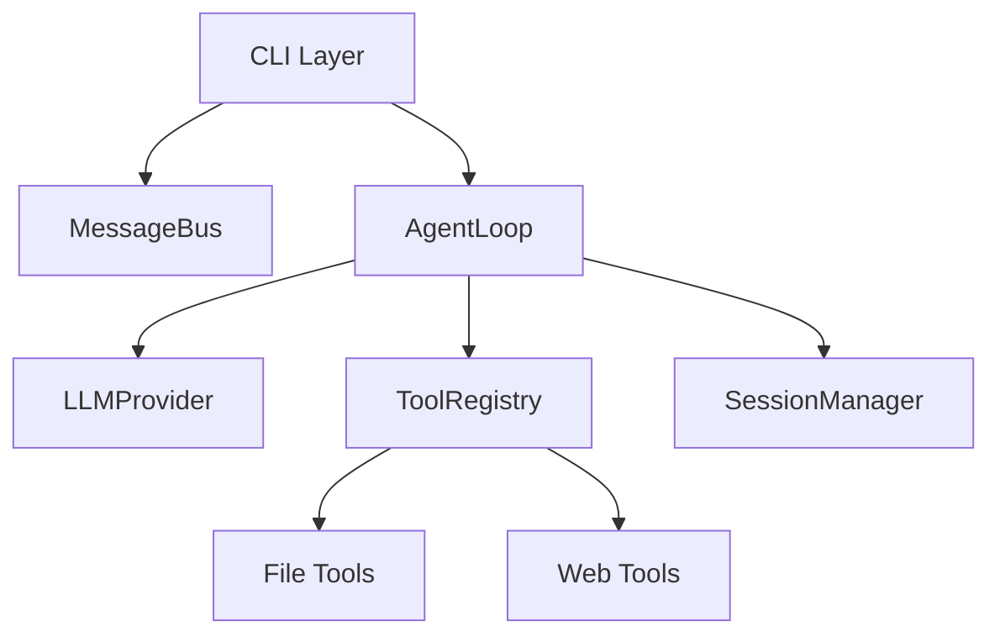

# Code Visualization Skill

生成项目架构和代码流程的可视化文档,帮助理解代码结构、执行流程和模块关系。

## 功能

本skill能够为任何编程语言的项目生成以下类型的图表:

- **时序图(Sequence Diagram)**:展示函数调用顺序、组件交互、消息传递流程
- **类图(Class Diagram)**:展示类的属性、方法、继承关系、组合关系
- **流程图(Flowchart)**:展示控制流逻辑、条件判断、循环结构
- **架构图(Architecture Graph)**:展示模块依赖关系、系统组件连接

所有图表使用 Mermaid 语法,可在 GitHub、VS Code、在线编辑器中直接渲染。

## 核心工作流程

### 1. 明确分析范围

首先确定用户想要分析的范围和图表类型:

**范围选项:**
- 单个文件(如:`loop.py` 的类图)
- 特定函数或方法(如:`process_direct()` 的时序图)
- 模块或子系统(如:Provider 系统的架构)
- 整个项目(如:项目完整依赖关系)

**图表类型:**
- **时序图**:适合展示函数调用链、消息处理流程、异步任务执行
- **类图**:适合展示面向对象设计、类层次结构、接口实现
- **流程图**:适合展示算法逻辑、决策流程、状态转换
- **架构图**:适合展示模块依赖、组件关系、系统结构

如果用户请求不明确,可通过以下问题澄清:
- "您想分析哪个文件或模块?"
- "您更关心类的结构,还是函数的调用流程?"
- "需要包含哪些关键组件?"

### 2. 读取相关代码

使用 `read_file` 工具读取需要分析的代码文件:

**单文件分析:**
```python
# 直接读取目标文件
read_file("nanobot/agent/loop.py")
```

**模块级分析:**
```python
# 使用 list_dir 找到相关文件
list_dir("nanobot/providers/")
# 读取核心文件
read_file("nanobot/providers/litellm_provider.py")
read_file("nanobot/providers/base.py")
```

**项目级分析:**
```python
# 读取入口文件和主要模块
read_file("nanobot/cli/commands.py")
read_file("nanobot/agent/loop.py")
read_file("nanobot/bus/queue.py")
```

**重要:** 仅读取项目内的代码文件,不分析第三方库的内部实现。

### 3. 分析代码结构

根据读取的代码,识别以下关键元素:

**类图所需信息:**
- 类定义:`class ClassName`
- 属性:实例变量、类变量
- 方法:公共方法、私有方法、静态方法
- 继承关系:`class Child(Parent)`
- 组合关系:实例持有其他类的引用
- 接口实现:抽象类、协议

**时序图所需信息:**
- 参与者:涉及的类或组件
- 函数调用链:A 调用 B,B 调用 C
- 消息传递:同步调用、异步调用
- 返回值:重要的返回结果
- 生命周期:对象创建和销毁

**流程图所需信息:**
- 起点和终点
- 条件分支:`if/else`
- 循环结构:`while/for`
- 异常处理:`try/except`
- 关键操作:赋值、调用、返回

**架构图所需信息:**
- 模块定义:文件或包
- 导入关系:`import`、`from ... import`
- 依赖方向:谁依赖谁
- 分层结构:CLI → Core → Storage

### 4. 选择合适的图表类型

根据分析目标,选择最合适的图表类型:

| 分析目标 | 推荐图表 | 理由 |
|---------|---------|------|
| 理解类的设计 | 类图 | 清晰展示属性、方法、关系 |
| 追踪函数调用 | 时序图 | 按时间顺序展示交互 |
| 理解算法逻辑 | 流程图 | 展示控制流和决策点 |
| 理解模块关系 | 架构图 | 展示依赖和分层 |
| 消息处理流程 | 时序图 + 流程图 | 结合交互和逻辑 |
| 系统初始化 | 时序图 | 展示组件创建顺序 |

**提示:** 复杂场景可生成多个图表,从不同角度展示。

### 5. 生成 Mermaid 代码

基于分析结果,生成清晰、准确的 Mermaid 代码。

**核心原则:**

1. **简洁性**:只包含关键信息,避免过度细节
2. **准确性**:基于实际代码,不要猜测或假设
3. **可读性**:使用中文标签,清晰的层次结构
4. **完整性**:包含必要的上下文,让读者理解流程

**参考 references 目录:**
- 查看 `references/mermaid-syntax.md` 了解语法细节
- 查看 `references/diagram-patterns.md` 学习优秀示例

**示例:类图**


**示例:时序图**
```mermaid
sequenceDiagram
    participant User as 用户
    participant CLI as CLI命令
    participant Loop as AgentLoop
    participant Provider as LLMProvider

    User->>CLI: nanobot agent -m "hello"
    CLI->>Loop: process_direct("hello")
    Loop->>Provider: chat(messages, tools)
    Provider-->>Loop: LLMResponse
    Loop-->>CLI: response
    CLI-->>User: 显示结果
```

**示例:流程图**


**示例:架构图**


### 6. 保存到文件

将生成的图表保存为 Markdown 文件,包含标题、说明和 Mermaid 代码块。

**默认保存路径:**
```
docs/diagrams/[描述性名称]-[图表类型].md
```

**文件命名规范:**
- 使用英文小写和连字符
- 包含模块或功能名称
- 包含图表类型后缀
- 示例:
  - `agent-loop-class-diagram.md`
  - `message-processing-sequence.md`
  - `provider-routing-flowchart.md`
  - `project-architecture.md`

**文件内容结构:**
```markdown
# [图表标题]

## 说明

[简要说明图表内容和用途]

## 图表

​```mermaid
[mermaid代码]
​```

## 关键要点

- [要点1]
- [要点2]
- [要点3]

## 相关文件

- [相关文件列表]
```

**保存操作:**
```python
write_file("docs/diagrams/agent-loop-class-diagram.md", content)
```

如果用户想更新现有文件,使用 `edit_file` 替换图表部分。

## 图表类型详细指南

### 时序图(Sequence Diagram)

**适用场景:**
- 函数调用链
- 消息传递流程
- 异步任务执行
- 初始化流程
- 请求-响应循环

**核心元素:**
- `participant`:定义参与者
- `->>` 和 `-->>`:实线箭头(同步)和虚线箭头(返回)
- `activate` / `deactivate`:激活框
- `Note`:注释说明
- `alt` / `else`:条件分支
- `loop`:循环

**最佳实践:**
- 限制参与者数量(3-7个)
- 使用中文标签
- 突出关键调用
- 简化次要细节
- 标注重要的返回值

### 类图(Class Diagram)

**适用场景:**
- 面向对象设计
- 类层次结构
- 接口实现
- 设计模式
- 组件依赖

**核心元素:**
- `class`:类定义
- `+` / `-` / `#`:可见性(公共/私有/保护)
- `<|--`:继承关系
- `-->`:依赖关系
- `*--` / `o--`:组合/聚合关系
- `<<interface>>`:接口标记

**最佳实践:**
- 只包含关键属性和方法
- 分组相关的类
- 清晰标注关系类型
- 使用中文注释
- 突出核心类

### 流程图(Flowchart)

**适用场景:**
- 算法逻辑
- 决策流程
- 状态转换
- 错误处理
- 控制流

**核心元素:**
- `[文本]`:矩形框(操作)
- `{文本}`:菱形框(判断)
- `([文本])`:圆角框(起止)
- `-->`:流向箭头
- `subgraph`:子图分组

**最佳实践:**
- 从上到下或从左到右布局
- 清晰的判断条件标签
- 避免交叉线
- 使用子图分组逻辑块
- 标注异常路径

### 架构图(Architecture Graph)

**适用场景:**
- 模块依赖关系
- 系统层次结构
- 组件连接
- 数据流向
- 服务拓扑

**核心元素:**
- `graph TB` / `graph LR`:方向(上下/左右)
- `A[文本]`:节点定义
- `-->`:有向边
- `subgraph`:分层或分组

**最佳实践:**
- 使用分层布局
- 清晰的依赖方向
- 分组相关模块
- 标注关键连接
- 使用中文标签

## 分析原则

### 1. 仅分析项目内代码

**包含:**
- 项目源代码文件
- 项目内的类和函数
- 项目定义的接口和协议

**排除:**
- 标准库(如 `os`、`json`、`asyncio`)
- 第三方库(如 `typer`、`litellm`)
- 外部服务 API

**示例:**
```python
# 分析这个
from nanobot.agent.context import ContextBuilder
context = ContextBuilder(workspace)

# 不分析这个
import asyncio
from litellm import acompletion
```

### 2. 简化复杂的调用链

**策略:**
- 合并重复的调用模式
- 省略次要的辅助函数
- 聚焦核心流程
- 使用注释说明省略部分

**示例:**
```mermaid
sequenceDiagram
    Note over Loop: 省略了参数验证、日志记录等辅助逻辑
    Loop->>Provider: chat(messages)
    Note over Provider: 内部包含多次重试和错误处理
    Provider-->>Loop: response
```

### 3. 突出核心流程

**重点展示:**
- 主要的数据流
- 关键的决策点
- 重要的依赖关系
- 核心的算法逻辑

**次要处理:**
- 错误处理可简化为分支
- 日志记录通常省略
- 辅助函数可合并
- 配置读取可简化

### 4. 保持图表可读性

**控制复杂度:**
- 单个图表不超过 15 个节点
- 时序图不超过 7 个参与者
- 类图不超过 10 个类
- 流程图避免深层嵌套

**过于复杂时:**
- 拆分为多个图表
- 创建概览图 + 详细图
- 使用子图分组
- 提供导航说明

## 参考资源

### Mermaid 语法参考

查看 `references/mermaid-syntax.md` 获取:
- 各类图表的完整语法
- 符号和关键字说明
- 样式和格式化选项

### 优秀图表示例

查看 `references/diagram-patterns.md` 学习:
- 项目中已有的优秀图表
- 不同场景的图表模式
- 中文标注的风格规范

这些参考文档包含真实的、经过验证的图表示例,可直接参考和借鉴。

## 使用示例

### 示例 1:为单个文件生成类图

**用户请求:**
> "为 loop.py 生成类图"

**执行步骤:**
1. 读取 `nanobot/agent/loop.py`
2. 识别 `AgentLoop` 类的属性和方法
3. 识别依赖的类(`MessageBus`、`LLMProvider` 等)
4. 生成类图 Mermaid 代码
5. 保存到 `docs/diagrams/agent-loop-class-diagram.md`

### 示例 2:展示消息处理的时序图

**用户请求:**
> "展示消息处理的完整时序图"

**执行步骤:**
1. 读取相关文件(`commands.py`、`loop.py`、`providers/`)
2. 分析 `process_direct()` 的调用链
3. 识别参与者:User、CLI、AgentLoop、Provider
4. 绘制时序图,标注关键调用
5. 保存到 `docs/diagrams/message-processing-sequence.md`

### 示例 3:创建项目架构图

**用户请求:**
> "生成项目的架构图,展示核心模块关系"

**执行步骤:**
1. 读取主要入口文件和核心模块
2. 识别模块依赖关系(CLI → Agent → Bus → Provider)
3. 使用 `graph TB` 布局
4. 使用 `subgraph` 分组分层
5. 保存到 `docs/diagrams/project-architecture.md`

### 示例 4:创建工具执行流程图

**用户请求:**
> "创建工具执行循环的流程图"

**执行步骤:**
1. 读取 `loop.py` 中的 `_run_agent_loop()` 方法
2. 识别控制流:循环、条件判断
3. 绘制流程图,展示 LLM → Tools → Iteration
4. 标注退出条件
5. 保存到 `docs/diagrams/tool-execution-flowchart.md`

## 工作流程检查清单

在生成图表前,确认:

- [ ] 已明确分析范围(文件/模块/项目)
- [ ] 已读取所有相关代码文件
- [ ] 已选择合适的图表类型
- [ ] 已识别关键的类、函数、依赖
- [ ] 图表复杂度适中(不过于简单或复杂)
- [ ] 使用中文标签和注释
- [ ] 仅包含项目内代码,忽略第三方库
- [ ] 代码块使用正确的 Mermaid 语法
- [ ] 文件保存路径和命名符合规范
- [ ] 包含标题、说明和关键要点

## 常见问题

**Q: 如何处理循环依赖?**
A: 在图表中使用双向箭头,并添加注释说明循环依赖的性质。

**Q: 如何表示异步调用?**
A: 时序图中使用虚线箭头 `-->>`,或添加 `Note` 说明异步特性。

**Q: 图表太复杂怎么办?**
A: 拆分为多个图表,创建概览图和详细图,使用子图分组。

**Q: 如何更新现有图表?**
A: 读取现有文件,使用 `edit_file` 替换图表部分,保留其他内容。

**Q: 如何验证图表正确性?**
A: 建议用户在 https://mermaid.live 或 VS Code 中预览渲染效果。

## 结语

本 skill 帮助你快速生成高质量的代码可视化文档,理解项目架构和代码流程。通过清晰的图表,可以:

- 快速理解复杂的代码逻辑
- 为新团队成员提供可视化文档
- 分析系统设计和架构模式
- 发现潜在的设计问题

开始使用时,先从简单的单文件类图开始,逐步尝试更复杂的时序图和架构图。
