# 优秀图表模式参考

本文档从 nanobot 项目现有文档中提取优秀的图表示例，展示各类图表的最佳实践。

## 类图模式

### 模式 1: 核心类与依赖组件

**适用场景**: 展示核心类及其依赖的组件，突出组合关系。

**示例**: AgentLoop 与依赖组件

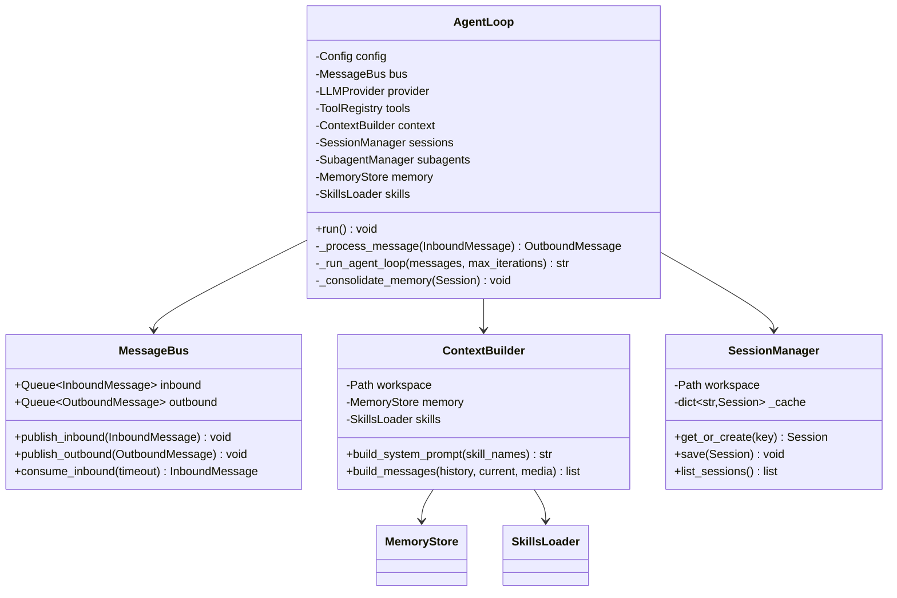

**关键特点**:
- 核心类在顶部，清晰展示所有依赖
- 属性使用 `-` 表示私有，方法使用 `+` 表示公共
- 依赖关系使用 `-->` 箭头
- 避免过多细节，只展示关键方法

### 模式 2: 抽象层与实现类

**适用场景**: 展示抽象类/接口与多个实现类的继承关系。

**示例**: LLMProvider 抽象层

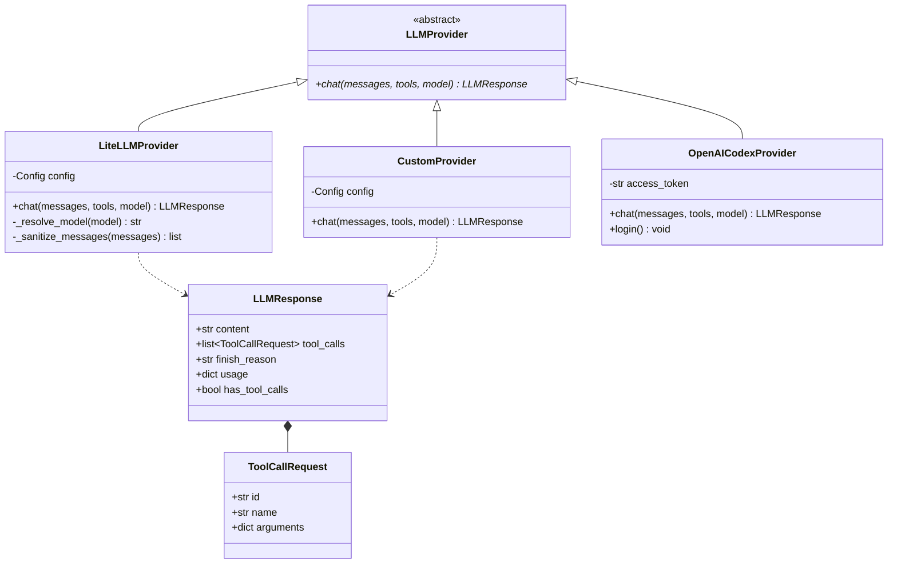

**关键特点**:
- 使用 `<<abstract>>` 标记抽象类
- 抽象方法使用 `*` 后缀
- 继承关系使用 `<|--`
- 依赖关系使用 `..>`
- 组合关系使用 `*--`

### 模式 3: 多态继承树

**适用场景**: 展示单个基类的多个子类实现。

**示例**: BaseChannel 抽象层

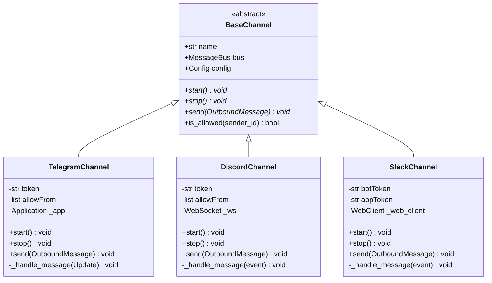

**关键特点**:
- 基类定义公共接口
- 子类实现具体细节
- 清晰展示多态性
- 使用中文注释说明职责

## 时序图模式

### 模式 1: 完整的消息处理流程

**适用场景**: 展示端到端的消息处理流程，包含多个组件交互。

**示例**: Memory Consolidation 流程

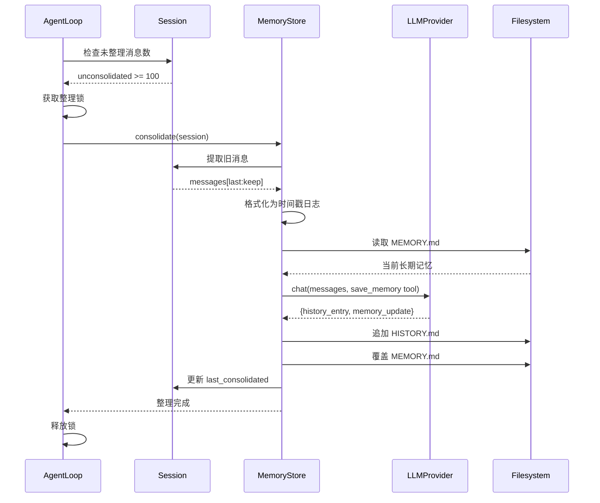

**关键特点**:
- 参与者使用中文标签
- 包含同步调用（`->>`）和返回（`-->>`）
- 标注关键的数据传递
- 使用 `Note` 可以添加说明

### 模式 2: 带条件分支的交互

**适用场景**: 展示包含条件判断的交互流程。

**示例**: Channel 消息处理（Telegram）

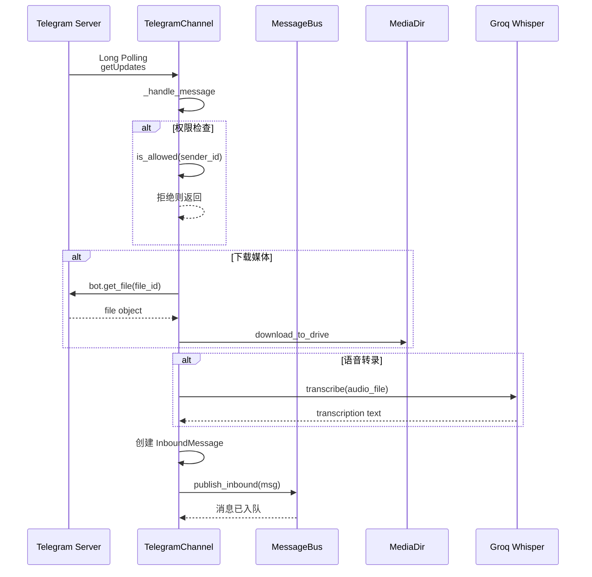

**关键特点**:
- 使用 `alt` / `end` 表示条件分支
- 自调用使用 `Ch->>Ch`
- 清晰的分支标签
- 使用 ` ` 换行

### 模式 3: 后台异步执行

**适用场景**: 展示主流程和后台异步任务的关系。

**示例**: Subagent 执行流程

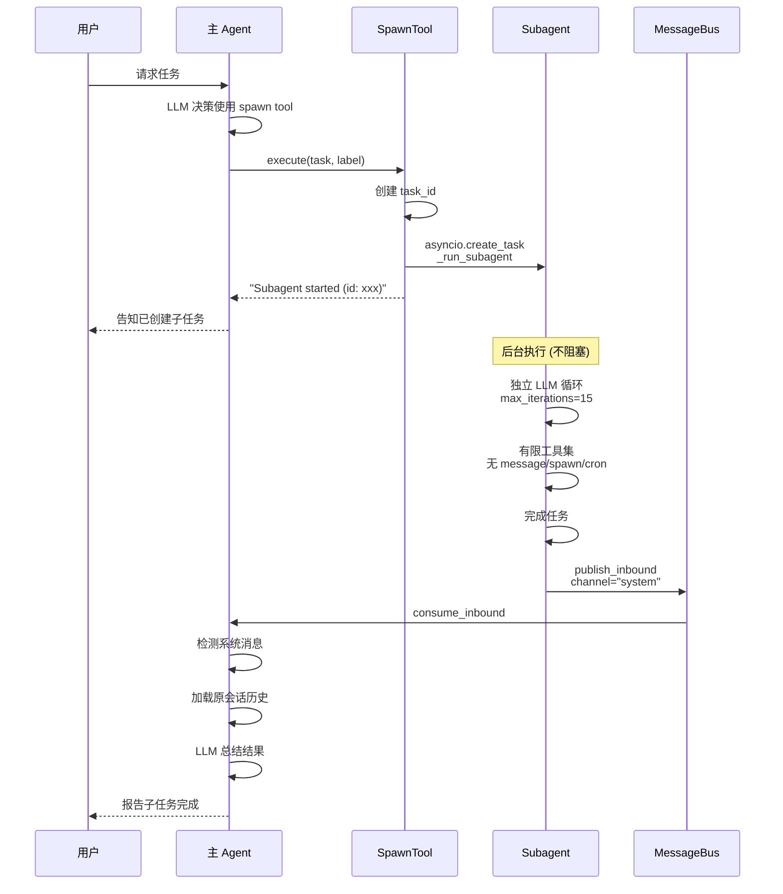

**关键特点**:
- 使用 `Note over` 说明后台执行
- 清晰区分同步和异步部分
- 标注关键的状态转换
- 使用中文描述

## 流程图模式

### 模式 1: 主流程图（单一路径）

**适用场景**: 展示核心处理流程，不包含复杂分支。

**示例**: AgentLoop 核心流程

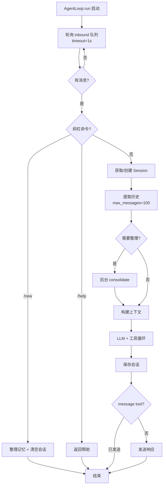

**关键特点**:
- 使用 `TD` (top-down) 布局
- 矩形框 `[]` 表示操作
- 菱形框 `{}` 表示判断
- 使用 ` ` 添加细节说明
- 清晰的判断标签（`|是|`、`|否|`）

### 模式 2: 循环迭代流程

**适用场景**: 展示包含循环的流程，如工具执行循环。

**示例**: LLM 工具执行循环

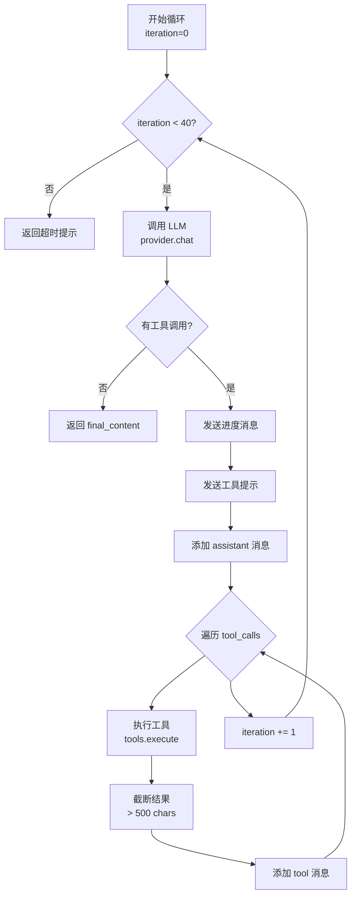

**关键特点**:
- 清晰的循环路径（回到起点）
- 多层嵌套判断
- 步骤详细标注
- 退出条件明确

### 模式 3: 复杂决策树

**适用场景**: 展示多级条件判断和回退逻辑。

**示例**: Provider 路由逻辑

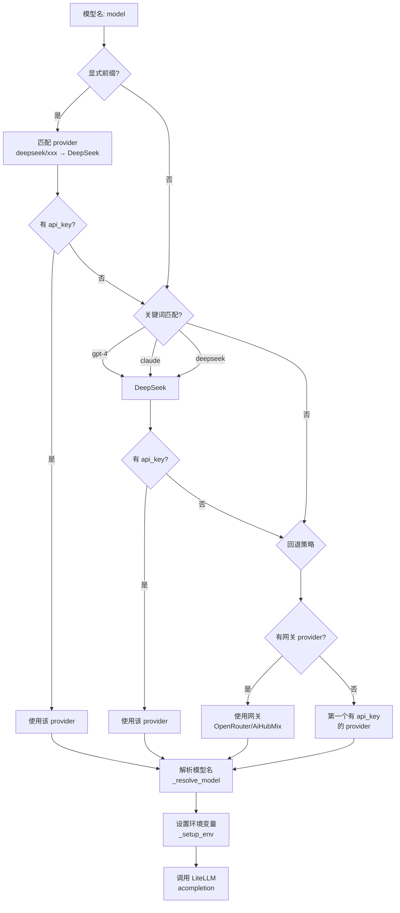

**关键特点**:
- 多级判断树
- 清晰的回退路径
- 汇聚点明确
- 标注关键条件

## 架构图模式

### 模式 1: 分层架构

**适用场景**: 展示系统的分层结构和数据流向。

**示例**: Context 构建流程

```mermaid
flowchart LR
    Start[开始构建] --> System[System Prompt]

    System --> Identity[1. Identity<br/>OS/Python/Workspace]
    Identity --> Bootstrap[2. Bootstrap Files<br/>AGENTS/SOUL/USER...]
    Bootstrap --> Memory[3. MEMORY.md<br/>长期事实]
    Memory --> AlwaysSkills[4. Always Skills<br/>完整内容]
    AlwaysSkills --> SkillsXML[5. Skills Summary<br/>XML 索引]

    SkillsXML --> History[6. Conversation History<br/>最近 100 条]
    History --> Current[7. Current Message<br/>文本 + base64 图片]

    Current --> Runtime[8. Runtime Context<br/>时间/Channel/ChatID]
    Runtime --> Messages[完整 messages 列表]
```

**关键特点**:
- 使用 `LR` (left-to-right) 布局
- 步骤编号清晰
- 使用 ` ` 添加细节
- 线性流程，易于理解

### 模式 2: 组件依赖关系

**适用场景**: 展示多个组件之间的依赖关系。

**示例**: 完整依赖关系图

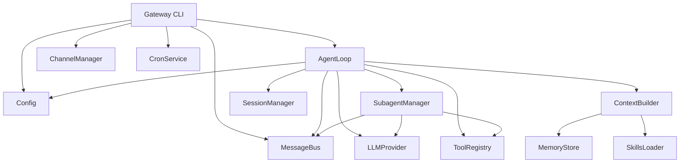

**关键特点**:
- 使用 `TD` (top-down) 布局
- 清晰的分层结构
- 避免交叉线
- 聚焦核心依赖

### 模式 3: 子图分组

**适用场景**: 展示复杂系统的模块分组。

**示例**: 系统架构图

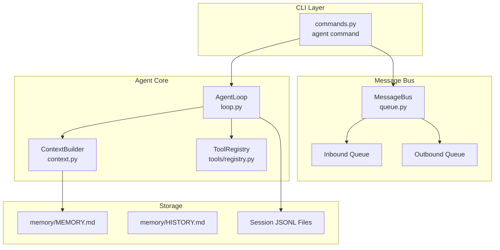

**关键特点**:
- 使用 `subgraph` 分组
- 清晰的分层标题
- 组内和组间的连接
- 标注文件路径

## 综合示例：完整的消息流转路径

**适用场景**: 展示端到端的复杂流程，结合多种元素。

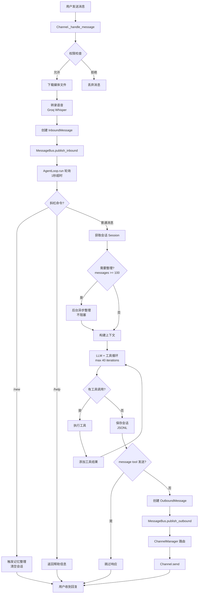

**关键特点**:
- 完整的业务流程
- 多个决策点
- 循环和分支并存
- 清晰的标注
- 使用中文标签

## 使用这些模式

1. **类图**: 选择合适的继承/组合模式，突出核心类
2. **时序图**: 清晰标注参与者，使用条件分支展示逻辑
3. **流程图**: 合理使用节点形状，控制图表复杂度
4. **架构图**: 使用子图分组，展示分层结构

所有图表都应：
- 使用中文标签和注释
- 简化次要细节
- 突出核心流程
- 保持可读性
