# Mermaid 语法速查表

本文档提供 Mermaid 图表语法的简明参考,涵盖四种核心图表类型。

## 类图 (Class Diagram)

### 基本语法

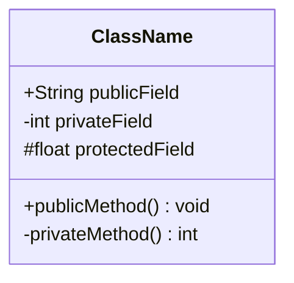

### 可见性修饰符

- `+` 公共 (public)
- `-` 私有 (private)
- `#` 保护 (protected)
- `~` 包级别 (package)

### 关系类型

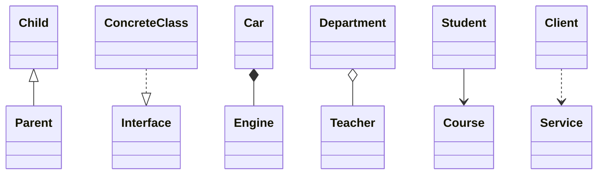

### 关系符号总结

| 关系 | 符号 | 说明 |
|------|------|------|
| 继承 | `<|--` | 实线三角箭头 |
| 实现 | `..|>` | 虚线三角箭头 |
| 组合 | `*--` | 实心菱形 (生命周期绑定) |
| 聚合 | `o--` | 空心菱形 (可独立存在) |
| 关联 | `-->` | 实线箭头 |
| 依赖 | `..>` | 虚线箭头 |

### 抽象类和接口

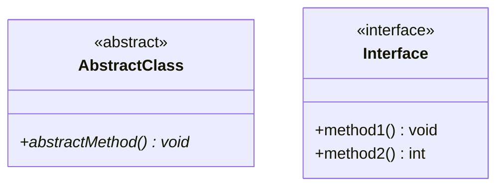

### 完整示例

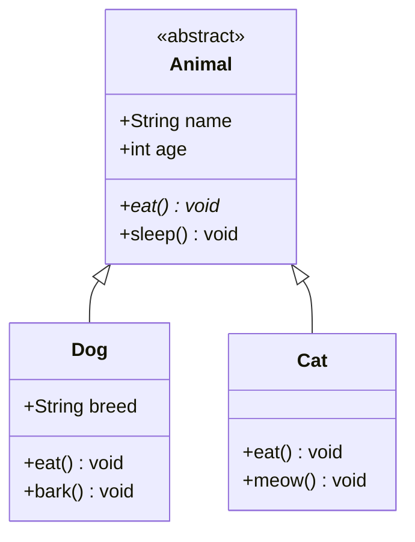

## 时序图 (Sequence Diagram)

### 基本语法

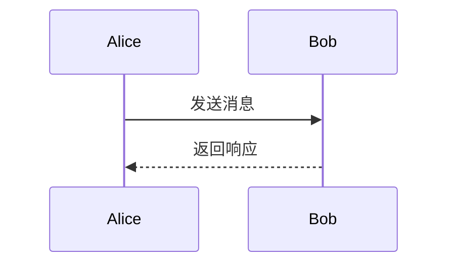

### 参与者定义

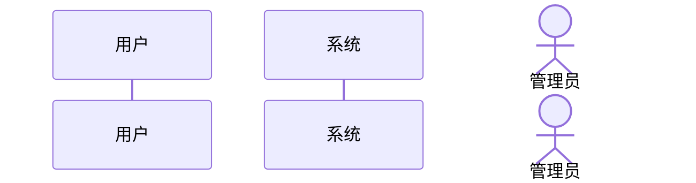

### 消息类型

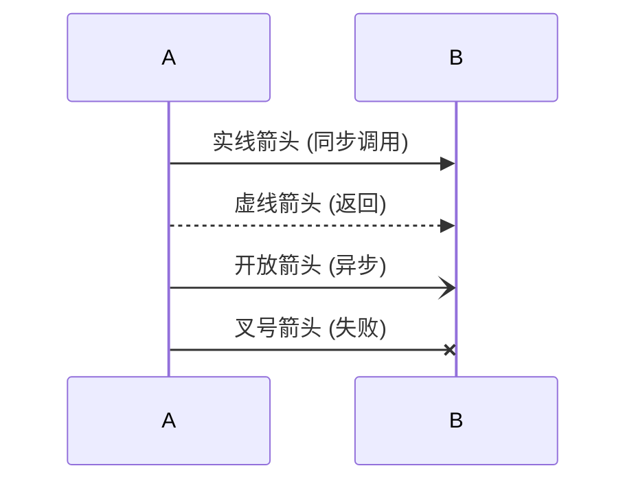

### 激活框

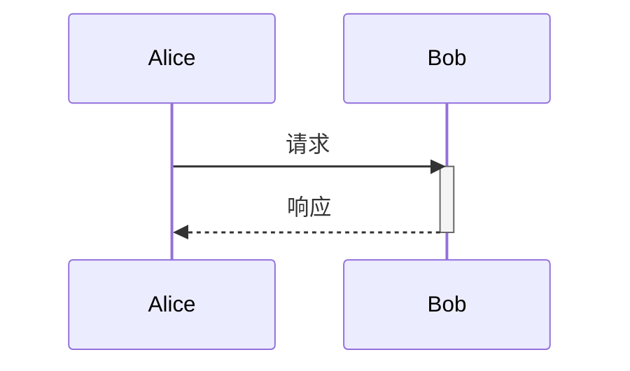

或使用简写:


### 注释和说明

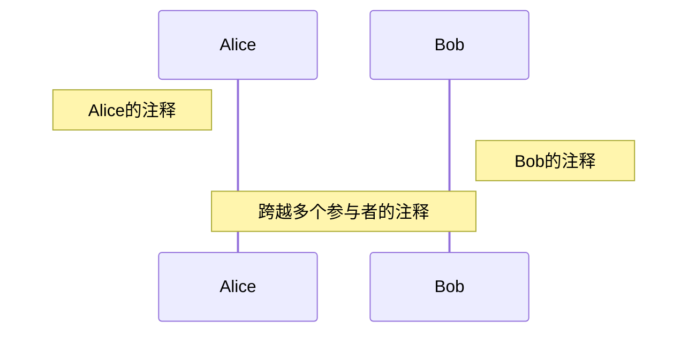

### 条件分支

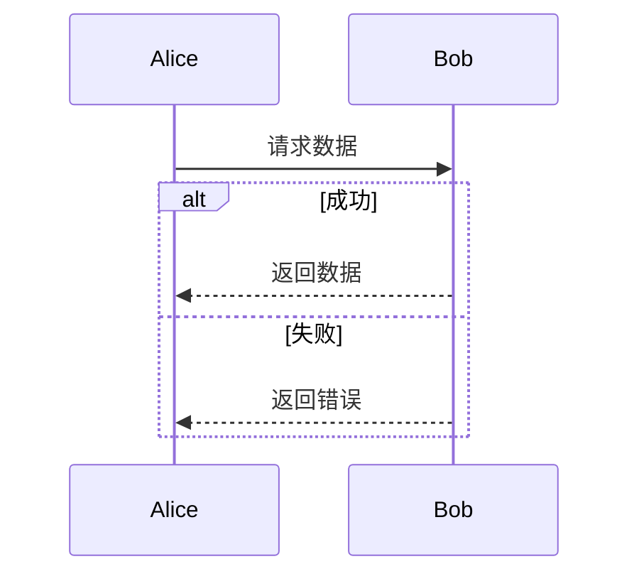

### 循环

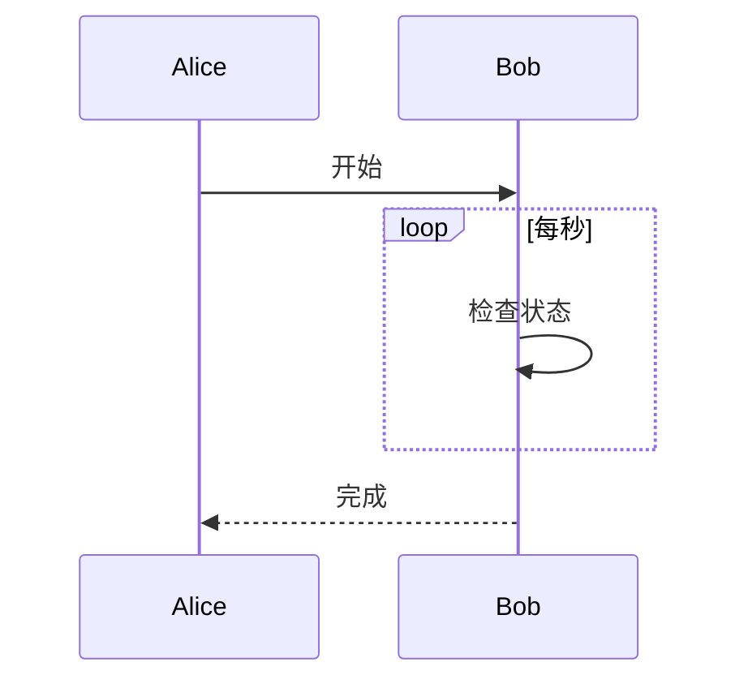

### 可选流程

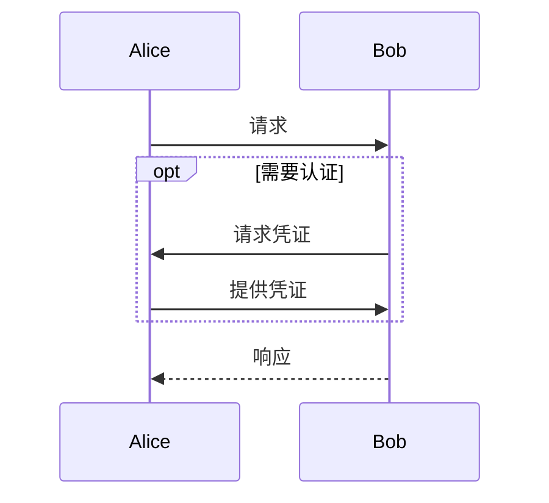

### 完整示例

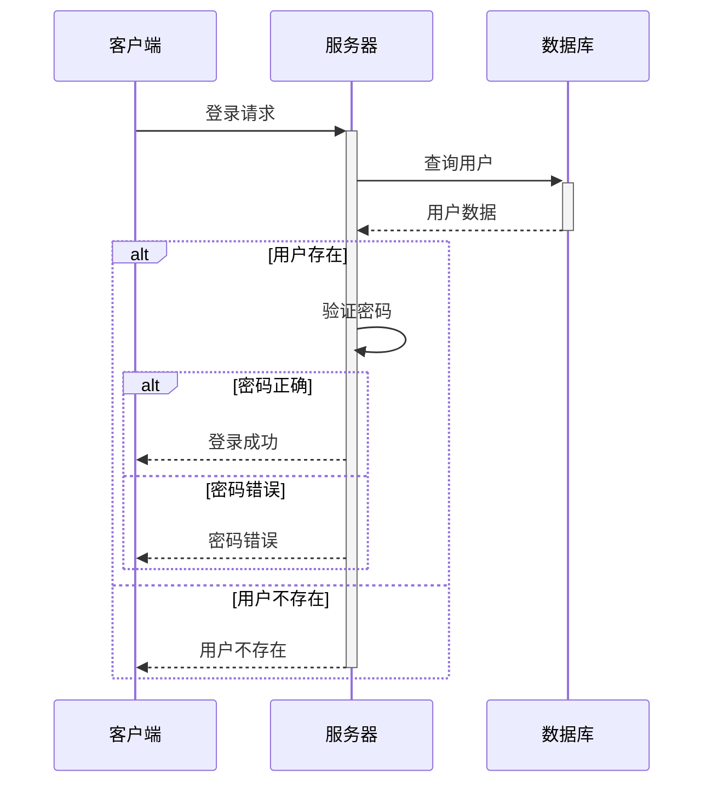

## 流程图 (Flowchart)

### 基本语法

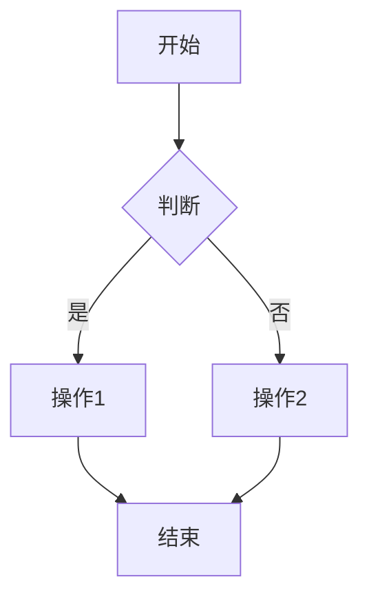

### 方向

- `TB` 或 `TD`: 从上到下 (top to bottom)
- `BT`: 从下到上 (bottom to top)
- `LR`: 从左到右 (left to right)
- `RL`: 从右到左 (right to left)

### 节点形状

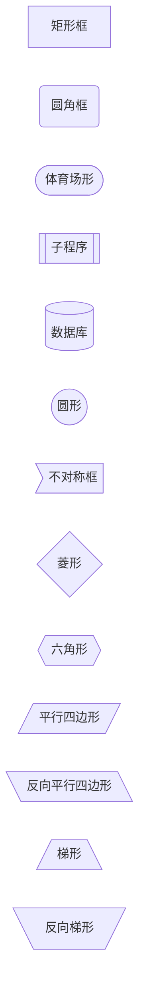

常用节点:
- `[文本]`: 矩形框(普通操作)
- `{文本}`: 菱形框(判断)
- `([文本])`: 圆角框(起止)
- `((文本))`: 圆形(连接点)

### 连接线类型

```mermaid
flowchart LR
    A --> B  实线箭头
    C --- D  实线
    E -.-> F  虚线箭头
    G -.- H  虚线
    I ==> J  加粗箭头
    K === L  加粗线
```

### 标签

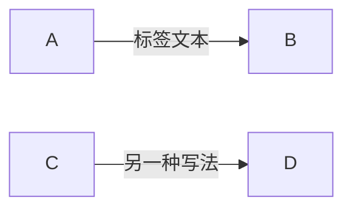

### 子图

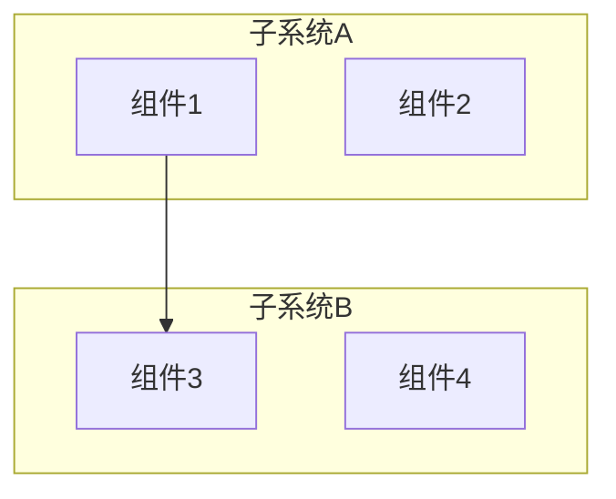

### 完整示例

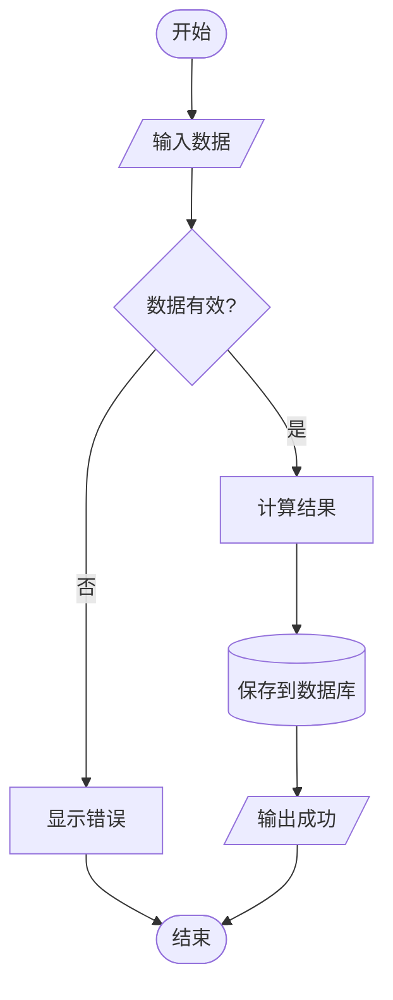

## 架构图 (Graph)

### 基本语法

```mermaid
graph TB
    A[前端] --> B[后端]
    B --> C[数据库]
    B --> D[缓存]
```

### 方向

与 flowchart 相同:`TB`、`BT`、`LR`、`RL`

### 节点定义

```mermaid
graph LR
    A[组件A]
    B(组件B)
    C{决策点}
    D((连接点))
```

### 连接和依赖

```mermaid
graph TD
    Frontend[前端层] --> API[API网关]
    API --> Auth[认证服务]
    API --> Business[业务服务]
    Business --> DB[(数据库)]
    Business --> Cache[(缓存)]
```

### 分层架构

```mermaid
graph TB
    subgraph 表现层
        UI[用户界面]
    end

    subgraph 业务层
        Service1[服务1]
        Service2[服务2]
    end

    subgraph 数据层
        DB[(数据库)]
        File[(文件存储)]
    end

    UI --> Service1
    UI --> Service2
    Service1 --> DB
    Service2 --> DB
    Service2 --> File
```

### 样式和类

```mermaid
graph LR
    A[正常节点]
    B[重要节点]
    C[警告节点]

    classDef important fill:#f96,stroke:#333,stroke-width:4px
    classDef warning fill:#ff9,stroke:#333

    class B important
    class C warning
```

### 完整示例

```mermaid
graph TB
    subgraph 客户端层
        Web[Web应用]
        Mobile[移动应用]
    end

    subgraph 服务层
        Gateway[API网关]
        Auth[认证服务]
        User[用户服务]
        Order[订单服务]
    end

    subgraph 数据层
        UserDB[(用户数据库)]
        OrderDB[(订单数据库)]
        Redis[(缓存)]
    end

    Web --> Gateway
    Mobile --> Gateway
    Gateway --> Auth
    Gateway --> User
    Gateway --> Order

    User --> UserDB
    User --> Redis
    Order --> OrderDB
    Order --> Redis
```

## 通用技巧

### 中文标签

所有图表都支持中文文本:

```mermaid
graph LR
    开始 --> 处理
    处理 --> 结束
```

### 注释

使用 `%%` 添加注释(不会在图表中显示):

```mermaid
graph LR
    %% 这是注释
    A --> B
```

### 转义特殊字符

使用引号包裹含有特殊字符的文本:

```mermaid
graph LR
    A["包含 () 的文本"]
    B["包含 [] 的文本"]
```

### 换行

使用 `<br/>` 在节点内换行:

```mermaid
graph LR
    A[第一行<br/>第二行]
```

## 在线编辑器

使用以下工具验证和预览 Mermaid 图表:

- **Mermaid Live Editor**: https://mermaid.live
- **GitHub**: 自动渲染 `.md` 文件中的 mermaid 代码块
- **VS Code**: 安装 Mermaid Preview 插件

## 参考资源

- **官方文档**: https://mermaid.js.org/
- **语法速查**: https://mermaid.js.org/intro/syntax-reference.html
- **示例图库**: https://mermaid.js.org/ecosystem/integrations-community.html
