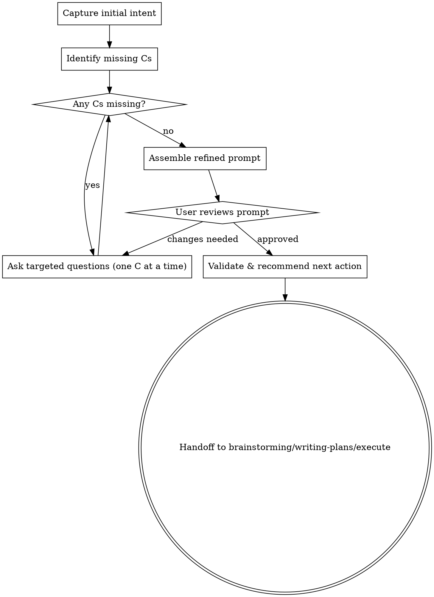

# Refining Prompts

## Overview

**Core Principle:** Well-structured prompts save hours of rework and clarification cycles.

This skill helps transform rough ideas or vague requests into clear, actionable prompts that produce better AI responses. Use the **5C Framework** to systematically refine user requests before implementation.

## When to Use

**Use refining-prompts when:**
- User has vague/incomplete initial request ("improve performance", "fix the bug", "add authentication")
- Starting complex multi-step work that needs clarity upfront
- Previous attempts produced unclear responses or missed requirements
- Request contains unexplained references or assumed context
- No clear success criteria or validation approach mentioned

**Skip when:**
- Request already clear and complete with specific details
- Simple single-step task with obvious intent
- Already in implementation phase (not starting fresh)
- User has provided detailed specifications

## The 5C Framework

Use these dimensions to systematically improve prompt quality:

| Dimension | Definition | Questions to Ask |
|-----------|------------|------------------|
| **Context** | Project state, relevant files, existing patterns | "What files/components are involved?" "What patterns should we follow?" "What's already been tried?" |
| **Constraint** | Technical/business/time limitations | "What can't we change?" "What libraries must we use/avoid?" "What performance/security requirements?" |
| **Clarity** | Specific, unambiguous, actionable language | "What exact behavior should change?" "Which specific endpoint/function?" "What does 'improve' mean quantitatively?" |
| **Criteria** | How success will be measured/validated | "How will we know it works?" "What tests should pass?" "What metrics define success?" |
| **Completeness** | All necessary details provided | "What edge cases matter?" "What error states exist?" "What's explicitly out of scope?" |

## Process Flow



### Step 1: Capture Initial Intent

Acknowledge the user's request and identify which of the 5Cs are present or missing.

**Example:**
```
User: "Add authentication"

Analysis:
✅ Clarity (partial) - "add authentication" is clear intent but lacks specifics
❌ Context - No mention of files, endpoints, or existing patterns
❌ Constraint - No tech stack preferences or requirements mentioned
❌ Criteria - No success validation mentioned
❌ Completeness - Missing details on auth method, storage, expiration
```

### Step 2: Systematic Refinement (One C at a Time)

For each missing or weak dimension, ask targeted questions. Use multiple choice when possible. Apply progressive disclosure (don't overwhelm).

**Question Strategy:**
- **One question at a time** (never overwhelm with 5+ questions)
- **Multiple choice preferred** (easier for users)
- **Progressive refinement:** Broad → Narrow → Specific

**Example Question Sequence:**
1. Context: "Which endpoint needs authentication? (a) All API endpoints (b) Just /api/users (c) Specific routes you'll list"
2. Constraint: "Do you have preferences for the auth method? (a) JWT (b) Session-based (c) OAuth (d) No preference"
3. Clarity: "For JWT, where should tokens be stored? (a) httpOnly cookies (b) localStorage (c) Authorization header only"
4. Criteria: "How should we validate this works? (a) Unit tests for middleware (b) Integration tests for protected routes (c) Both"
5. Completeness: "What should happen for unauthenticated requests? (a) 401 with error message (b) Redirect to /login (c) Other"

### Step 3: Structured Prompt Assembly

Present the refined prompt in clear sections. Get user review and confirmation. Iterate based on feedback.

**Template:**
```markdown
## Refined Prompt

**Goal:** [One sentence summary]

**Context:**
- Files/components involved: [specific paths]
- Existing patterns: [what to follow]

**Requirements:**
- [Specific behavior 1]
- [Specific behavior 2]
- [Specific behavior 3]

**Constraints:**
- [Limitation 1]
- [Limitation 2]

**Success Criteria:**
- [How to validate 1]
- [How to validate 2]

**Out of Scope:**
- [What NOT to do]
```

### Step 4: Validation & Handoff

Final review, then recommend next action:

→ **brainstorming** - If creative/design decisions needed (multiple approaches, architecture choices)
→ **writing-plans** - If implementation with clear spec (multi-step task, needs detailed plan)
→ **Direct execution** - If simple, single clear action (one file change, obvious implementation)

## Key Techniques

### Ambiguity Detection Patterns

| Vague Signal | What's Missing | Question to Ask |
|--------------|----------------|-----------------|
| Vague verbs ("improve", "fix", "update") | Specific behavior change | "What exact behavior should change?" |
| Unclear scope ("the API", "the system") | Specific files/components | "Which specific files or endpoints?" |
| Missing criteria (no testing mentioned) | Validation approach | "How will we know this works?" |
| Assumed context (unexplained references) | Background information | "Can you clarify what X refers to?" |
| No constraints mentioned | Limitations/requirements | "Are there any technical constraints?" |
| Generic success ("make it work") | Measurable outcome | "What metrics define success?" |

### Clarity Transformations

**Before/After Examples:**

| Vague | Clear |
|-------|-------|
| "Add authentication" | "Add JWT-based authentication to /api/users endpoint with httpOnly cookies and 24hr expiration" |
| "Fix the bug" | "Fix null pointer in UserService.validate() when email field is missing from request body" |
| "Improve performance" | "Reduce /search response time from 2s to <500ms via database indexes on user.email and post.created_at" |
| "Clean up the code" | "Refactor UserController to extract validation logic into UserValidator class, following existing ValidationService pattern" |
| "Make it responsive" | "Add CSS media queries for tablet (768px) and mobile (375px) breakpoints to dashboard layout" |

### Question Framing Templates

**Context Questions:**
- "What files or components are involved in [X]?"
- "What existing patterns should we follow for [Y]?"
- "Has anything been tried already for [Z]?"

**Constraint Questions:**
- "Are there libraries we must use or avoid?"
- "What performance/security requirements apply?"
- "What can't we change?"

**Clarity Questions:**
- "What exact behavior should change from current to desired?"
- "Which specific function/endpoint/component?"
- "Can you describe the expected output for input [X]?"

**Criteria Questions:**
- "How will we know this works correctly?"
- "What tests should pass?"
- "What metrics define success?"

**Completeness Questions:**
- "What edge cases should we handle?"
- "What error states exist?"
- "What's explicitly out of scope?"

## Integration Points

After refining the prompt:

**→ Invoke brainstorming if:**
- Multiple valid approaches exist
- Design decisions needed
- User wants to explore alternatives
- Architecture choices required

**→ Invoke writing-plans if:**
- Implementation approach is clear
- Multi-step task needs detailed plan
- Ready for execution with specs

**→ Direct execution if:**
- Simple, single clear action
- One file change
- Obvious implementation
- No design decisions needed

## Anti-Patterns

**Don't do this:**

❌ **Ask all 5Cs at once** - Overwhelming, users won't answer thoroughly
✅ **Instead:** Progressive disclosure, one dimension at a time

❌ **Skip refinement for "simple" tasks** - Assumptions cause rework
✅ **Instead:** Quick pass through 5Cs (can be fast for truly simple tasks)

❌ **Make assumptions without validating** - Leads to wrong implementation
✅ **Instead:** Ask explicitly, even if answer seems obvious

❌ **Use open-ended questions only** - Harder for users to answer
✅ **Instead:** Multiple choice when possible, with "Other" option

❌ **Refine forever (perfectionism)** - Diminishing returns
✅ **Instead:** Stop when prompt passes completeness check (see below)

## Completeness Check

A refined prompt is ready when it can answer:

1. **What** - Specific behavior change or feature
2. **Where** - Exact files, functions, or components
3. **Why** - Context and purpose
4. **How to validate** - Success criteria and tests
5. **What NOT to do** - Scope boundaries and constraints

If someone unfamiliar with the project could understand the request, you're done.

## Example Workflow

**Initial Request:**
"Make the app faster"

**Step 1 - Capture Intent:**
- Clarity (weak) - "faster" is vague
- Missing: Context, Constraint, Criteria, Completeness

**Step 2 - Refinement:**
```
Q: "What part of the app feels slow?"
A: "The search page"

Q: "What specifically is slow? (a) Page load (b) Search results appearing (c) Both"
A: "Search results appearing"

Q: "What's the current response time and what's acceptable?"
A: "Currently ~2 seconds, want under 500ms"

Q: "Do you know where the bottleneck is? (a) Database query (b) API call (c) Frontend rendering (d) Not sure"
A: "Not sure, need to investigate"

Q: "What search functionality exists? Which files?"
A: "SearchController.ts and SearchService.ts handle it"

Q: "How should we validate the improvement?"
A: "Measure response times before/after with realistic data"
```

**Step 3 - Assembled Prompt:**
```markdown
## Refined Prompt

**Goal:** Reduce search response time from 2s to <500ms

**Context:**
- Files: SearchController.ts, SearchService.ts
- Current implementation: [would read files to understand]

**Requirements:**
- Profile current search to identify bottleneck
- Optimize to achieve <500ms response time
- Maintain existing search functionality

**Constraints:**
- Must work with current database schema
- Can't break existing API contract

**Success Criteria:**
- Response time <500ms with realistic dataset
- All existing search tests still pass
- Before/after performance metrics documented

**Investigation Needed:**
- Database query performance
- Index usage
- N+1 query issues
- Frontend rendering time
```

**Step 4 - Handoff:**
"This looks ready. I recommend we invoke **brainstorming** first to profile the bottleneck and explore optimization approaches (database indexes, caching, query optimization, etc.), then create an implementation plan."

## Checklist

When using this skill:

1. ☐ Capture initial intent and identify missing Cs
2. ☐ Ask questions one at a time (prefer multiple choice)
3. ☐ Refine each weak dimension progressively
4. ☐ Assemble structured prompt with all 5Cs addressed
5. ☐ Get user review and confirmation
6. ☐ Validate completeness (can unfamiliar person understand it?)
7. ☐ Recommend appropriate next action (brainstorming/writing-plans/execute)

## Remember

**The goal is actionable clarity, not bureaucracy.** For truly simple requests, this can take 2-3 questions. For complex work, invest the time upfront to save hours later. When in doubt, ask one good question.
